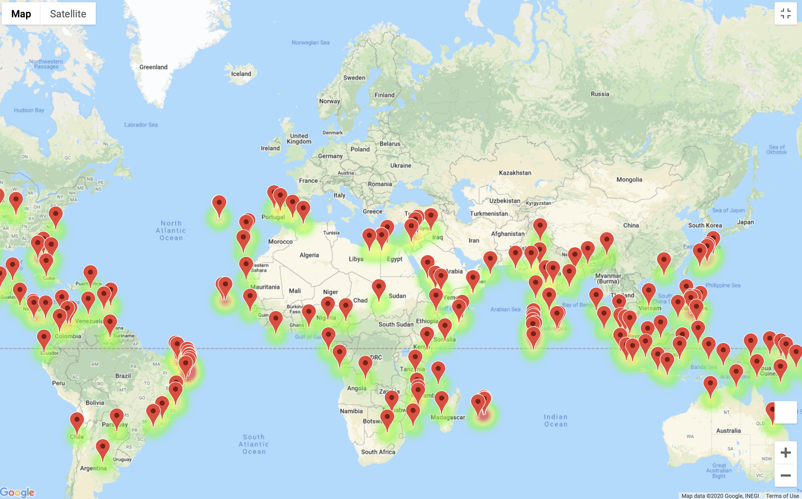

# World_Weather_Analysis
#### Summary
This project involves adding the weather description to the PlanMyTrip app. The input statements is added to the app for customer to filter the data for their weather preferences, which will be used to identify potential travel destinations and nearby hotels. From the list of potential travel destinations, the beta tester will choose four cities to create a travel itinerary. 

#### Resources
Pandas, Google Maps Directions API and Open Weather API are used to  create a travel route between the four cities as well as a marker layer map.
