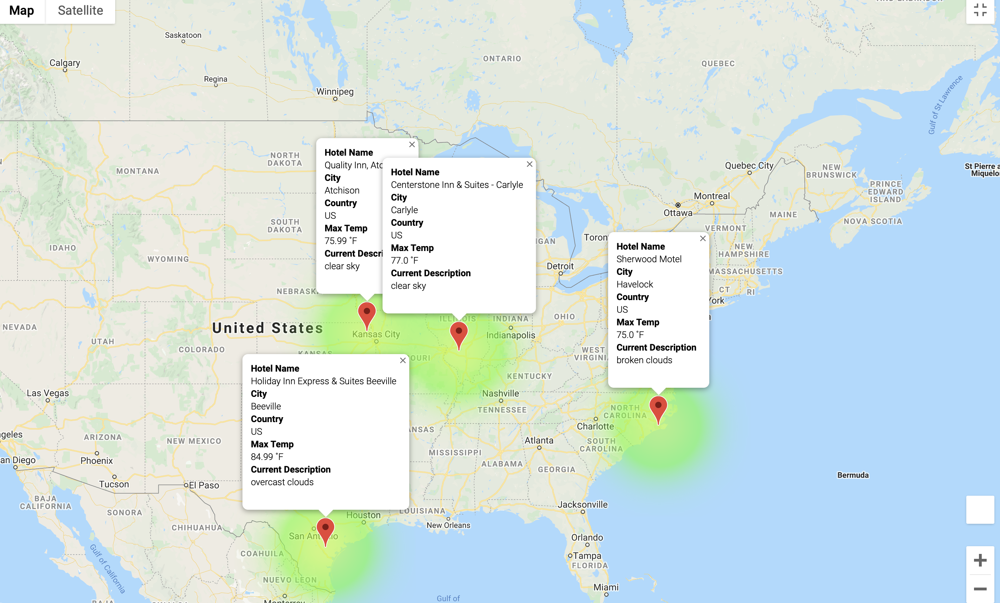
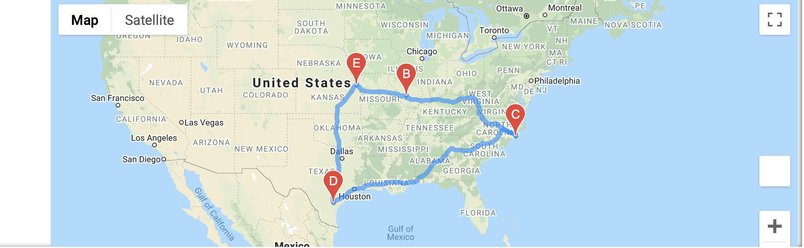

# World Weather Analysis for PlanMyTrip App
## Project Objective
To add a google map to the PlanMyTrip app to be more comfortable for the users to get the full detail of the hotels they are intended to book and the weather of the location
## Method Used
- Data Visualization
## Technologies
- Python
- Pandas, Jupyter
- Google Maps Directions API
- Open Weather API
## Needs of this project
- The users of PlanMyTrip app
## Project Description
This project involves adding the weather description to the PlanMyTrip app. The input statements is added to the app for customer to filter the data for their weather preferences, which will be used to identify potential travel destinations and nearby hotels. From the list of potential travel destinations, the customers will choose four cities to create a travel itinerary. 

